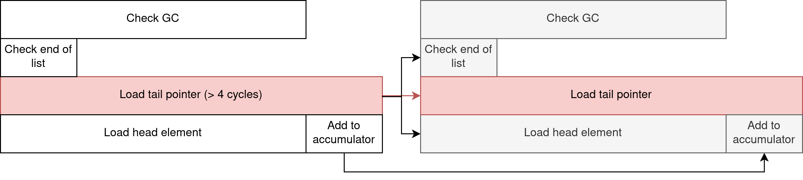
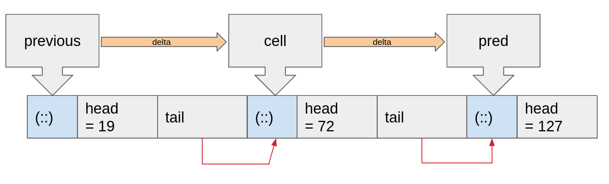
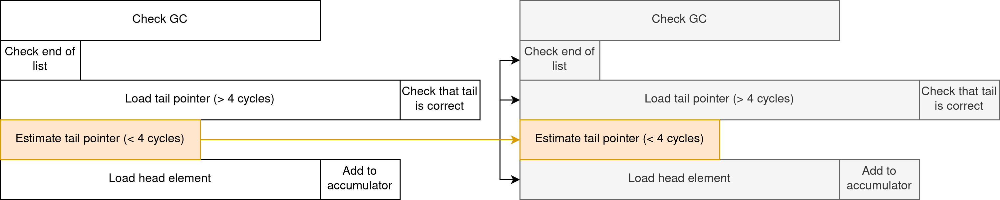
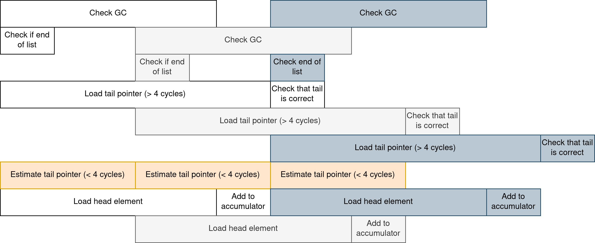

CPUs are very good at doing things in parallel, even in a single core context.
Indeed, speculative execution of code and instruction reordering helps the CPU
ensure that the pipeline is always full. However, data dependencies in the
sequence of instructions might cause the CPU to have to wait for data, be it
from the L1 cache or the much slower RAM storage. Francesco Mazzoli shows in their blog post, [Beating the L1 cache with value speculation](https://mazzo.li/posts/value-speculation.html) ,
that optimizing the critical path will in some conditions yield huge performance
improvements.

This article demonstrates that this optimisation can be implemented in the
OCaml programming language. Knowing how OCaml values are represented in memory is useful, here is a chapter of Real World OCaml on that matter: [Memory Representation of Values](https://dev.realworldocaml.org/runtime-memory-layout.html).

## Fast list iterations using one simple trick™

Let's start by instantiating a linked list of 10000 random numbers.

```ocaml
let l = List.init 10000 (fun _ -> Random.int 1024)
```

Now, let's sum the numbers 100k times and see how long that takes. To obtain these statistics, `perf stat` was used with the default settings on programs compiled with OCaml 5.0.

```ocaml
let rec sum (accumulator: int) (cell: int list) =
  match cell with
  | head::tail -> sum (accumulator + head) tail
  | [] -> accumulator

for _ = 1 to 100000 do
  ignore (sum 0 l)
done
```

```
 Performance counter stats for './a.out sum':

          1 368,91 msec task-clock:u                     #    0,999 CPUs utilized
     4 835 597 233      cycles:u                         #    3,532 GHz
     9 005 641 989      instructions:u                   #    1,86  insn per cycle
     3 001 229 709      branches:u                       #    2,192 G/sec
           195 819      branch-misses:u                  #    0,01% of all branches
```

Conveniently, we're doing one billion additions (10000 list items, repeated 100k times). So each iteration is taking:

- 1.36 nanoseconds
- 4.8 cycles
- 9 instructions
- 3 branches

We can already see that the CPU is cramming multiple instructions per cycle.
Using the [compiler explorer](https://godbolt.org/), the following assembly is obtained:

```nasm
camlExample__sum_268:
        subq    $8, %rsp
.L101:
        cmpq    (%r14), %r15         # check if GC is waiting for us
        jbe     .L102                # branch #1
.L103:
        testb   $1, %bl              # check if at end of list
        je      .L100                # branch #2
        addq    $8, %rsp
        ret
.L100:
        movq    8(%rbx), %rdi        # load tail element of list
        movq    (%rbx), %rbx         # load head element of list
        leaq    -1(%rbx,%rax), %rax  # add it to accumulator
        movq    %rdi, %rbx           # move tail element for next iteration
        jmp     .L101
.L102:
        call    caml_call_gc@PLT
.L104:
        jmp     .L103
```

I've tried to think like a CPU in order to explain the numbers according to the perf results, but as so many pieces are involved I assumed it would be hard for everything to be correct. Instead, we'll try to get a good _intuition_ by thinking in terms of _data dependency_. Basically, the assumption is that things that do not depend on each other can be ran in parallel. The second assumption is that thanks to the _branch predictor_, branch instructions are supposed to have zero cost and they don't introduce data dependencies. Instead, the CPU predicts whether the program will go through the branch and continue execution. In case of misprediction, the CPU will roll back computations for us.

So here is the data dependency chart for this program, showing how two iterations are expected to be ran, with the critical path in red:



Even if the tail pointer is loaded from cache, we still have to pay a 4 cycles cost to fetch from the L1 cache.

The **Check GC** part of the loop is independent from the rest, and is useful in a multicore context as every domain of the program has to synchronize when performing garbage collection.

## Value speculation

It's time to open the rune book and perform some dark magic. We know that we
won't get past that 4 cycles per iteration bottleneck unless there is a way to
bypass the pointer chasing. To do that, we're going to do what was done in
the value speculation article, but in pure OCaml.

import ObjMagic from "./obj_magic.jpg";

The principle is the same: `cell` is converted to a "pointer" using the forbidden <a href={ObjMagic}>`Obj.magic`</a> function. Using the value of the `previous` list
cell pointer, we can compute `delta`, the number of bytes between the two last cells.
This is used to estimate where will be the next cell. If the prediction is correct,
the memory load of the next cell address is effectively bypassed, and the CPU can
directly start working on the next iteration. If not, the branch predictor rolls back the
computation.{" "}



```ocaml
let rec sum (previous : int) (accu : int) (cell : int list) =
  match cell with
  | [] -> accu
  | head::tail ->
    let current : int = Obj.magic cell in
    let prediction : int list =
      Obj.magic (2 * current - previous)
    in
    sum
      current
      (accu + head)
      (if prediction == tail then prediction else tail)
```

```
 Performance counter stats for './a.out seum':

            944,67 msec task-clock:u                     #    1,000 CPUs utilized
     3 422 107 884      cycles:u                         #    3,623 GHz
    16 006 647 403      instructions:u                   #    4,68  insn per cycle
     5 001 230 197      branches:u                       #    5,294 G/sec
           225 781      branch-misses:u                  #    0,00% of all branches
```

Per iteration:

- 0.94 nanoseconds
- 3.4 cycles
- 16 instructions
- 5 branches

We got past the bottleneck ! What we're effectively doing is transforming the list iteration into an array iteration. And this works, because there are situations where OCaml lists are allocated in a linear fashion, making the cell addresses predictible. Note in particular the huge number of instructions per cycle.

If you are not convinced, here is an updated dependency diagram for this program.



By moving the tail pointer load outside of the critical path, the CPU is able to do more things at once. The following chart shows how one can expect the CPU to execute instructions for three iterations in parallel.



### Optimized

I was not satisfied by this mere 45% improvement. What if the loop was unrolled, so that the CPU has more freedom to move instructions around ?

```ocaml
let rec seum_unroll (previous : int) (accu : int) (cell : int list) =
  match cell with
  | [] -> accu
  | [a] ->  accu + a
  | [a; b] -> accu + a + b
  | [a; b; c] -> accu + a + b + c
  | a::b::c::d::tail ->
      let current = Obj.magic cell in
      let prediction : int list =
        Obj.magic (2 * current - previous)
      in
      seum_unroll
        current
        (accu + a + b + c + d)
        (if prediction == tail then prediction else tail)
```

The idea is to iterate on the list by chunks of 4 items. There is still the same amount of work to do, but the value prediction trick is performed once every 4 element.

```
 Performance counter stats for './a.out seum_unroll':

            715,58 msec task-clock:u                     #    0,999 CPUs utilized
     2 410 830 333      cycles:u                         #    3,369 GHz
     7 756 543 257      instructions:u                   #    3,22  insn per cycle
     2 001 229 820      branches:u                       #    2,797 G/sec
           112 956      branch-misses:u                  #    0,01% of all branches
```

Per iteration:

- 0.72 nanoseconds
- 2.4 cycles
- 7.7 instructions
- 2 branches

<h1 style={{ fontSize: "4em", marginTop: "-50px", marginBottom: "-50px" }}>
  <b>91.3%</b> faster. Nice.
</h1>

According the original article, we're now faster than the naive C implementation, but 2x slower than the hand-optimized one. This is all very synthetic but I found it quite interesting that OCaml is able to benefit from the same hacks as C. Of course this won't be useful in a lot of situations, but maybe one will gain some insights on how modern CPU are able to make programs go fast.

---

If you like this article I'd be glad to have your feedback. 
Public discussion on [Twitter](https://twitter.com/TheLortex/status/1654563811569836032)
